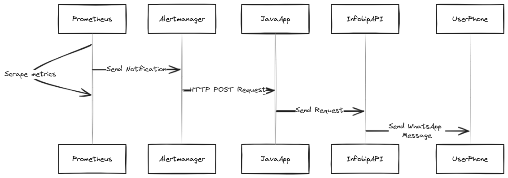

# Prometheus WhatsApp API integration
***

Materials for a tutorial available at https://www.infobip.com/docs/tutorials

***

### Overview


This project illustrates how to integrate Prometheus with Infobip's WhatsApp API in order to receive alerts on a mobile
phone, project has three components: `Prometheus`, `Alertmanager` and `Infobip-Prometheus-Alerting` a simple Spring boot application that connects the 
Prometheus alert with the Infobip's WhatsApp API. Below is a high level overview:
<br>
<br>


<br>

***

### Setup

Project can be run using `Docker`, it requires an account on Infobip and a WhatsApp API key with the scope `whatsapp:message:send`,
before running `docker compose` command, the placeholders in `.env` need to be replaced with:

- Infobip API key
- Personal Infobip base url
- Sender phone number
- Recipient phone number

Project can be started by running the following command

```shell
docker compose up --build -d
```

After project starts up, Prometheus will be available at `http://localhost:9090` and Alertmanager at `http://localhost:9093`.
The Prometheus and Alermanager consoles can be used to inspect the status of the Alerts, the same alert should land on the recipient
phone number ~30 seconds after the alert has fired on Prometheus. The page `http://localhost:8080/index.html` will automatically render the response from Infobip API.

To shut down the example, the following command need to be executed from the project root directory:

```shell
docker compose down
```


